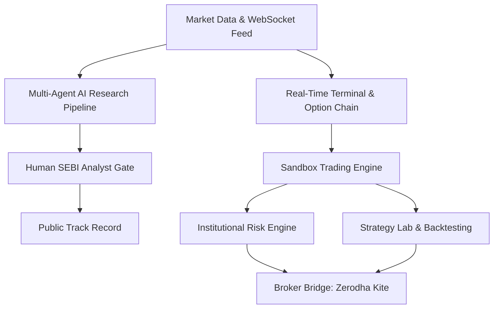

# Product Summary & Introduction: Algoryq Trade

---

## 🌟 Executive Overview

**Algoryq Trade** (built under the `@alphaedge/website` suite) is an **institutional-grade market intelligence terminal, sandbox paper-trading engine, and AI research platform tailored specifically for the Indian financial markets** (NSE, BSE, MCX, currency derivatives, and mutual funds).

Unlike generic trading platforms, Algoryq Trade is built around a core philosophy of **code-enforced honesty, radical transparency, and regulatory compliance (SEBI RA / DPDP)**. It allows traders—from retail beginners to experienced options & quantitative traders—to analyze, backtest, and paper-trade with real-time/replayed market data and virtual capital under realistic execution and charge constraints.

---

## 🚀 Key Differentiating Pillars

1. **Discipline over Claims**  
   Algoryq Trade rejects fabricated profit assertions, fake user numbers, and unverified testimonials. Every market call, strategy result, and track record figure is measured **net of every single charge** (to the paisa) and backed by statistical confidence metrics (Wilson confidence intervals).

2. **Realistic Indian Charge Stack Engine**  
   Most paper-trading tools ignore transaction overheads. Algoryq Trade’s simulation engine computes the full, exact Indian fee stack for every paper order:
   - Brokerage
   - Securities Transaction Tax (STT / CTT)
   - Exchange Transaction Charges
   - SEBI Turnover Fees
   - Stamp Duty & GST (18%)

3. **Multi-Agent AI Research with Human SEBI Analyst Gate**  
   An AI research pipeline powered by 5 specialized virtual analysts (Technical, Fundamental, Quant, Macro, Sentiment) overseen by a virtual Chief Investment Officer (CIO). Every AI insight is audit-chained and gated behind human SEBI Research Analyst approval before publication.

4. **"Automation Where Safe, Confirmation Where Real"**  
   Full server-side automation is supported inside the paper-trading sandbox (trailing stops, invalidation exits, MIS auto square-off, margin alerts). For live trading, Algoryq Trade enforces step-up MFA and manual per-order user confirmation to strictly align with SEBI retail algorithmic trading guidelines.

---

## 🛠️ Core Platform Capabilities

### 1. Market Intelligence & Live Terminal
- **Market Coverage:** NSE (Equities & F&O), BSE, MCX (Commodities), Currency Derivatives, and Mutual Funds (AMFI NAVs, SIP tracking, XIRR).
- **Advanced Visualization:** High-performance charting with 30+ CI-verified technical indicators.
- **Derivatives Surface:** Option chain with live Black-76 Greeks ($\Delta, \Gamma, \Theta, \nu, \rho$), IV skew surface, and real-time market breadth / FII-DII institutional flow metrics.

### 2. Realistic Sandbox & Fills Engine
- **Order Execution:** Market, Limit, Stop-Market, and Stop-Limit orders with realistic slippage, liquidity depth checks, and partial fill modeling.
- **Server-Side Order Management:** Trailing stop-losses, invalidation exits, R-multiplier progress alerts, and automatic intraday (MIS) square-off.

### 3. Strategy Lab & Quant Backtesting
- **Backtest Validation:** Robust quantitative backtesting suite featuring walk-forward analysis, embargo windows, Deflated Sharpe ratios, and Monte Carlo simulations to eliminate overfitting and look-ahead bias.

### 4. Institutional-Grade Risk Engine
- **Pre-Trade Risk Checks:** 10 pre-trade validations, Value at Risk (VaR), portfolio heat scoring, circuit-breaker rules, and instant emergency kill-switch controls.

### 5. Multi-Broker Bridge
- **Execution Safeguards:** Built with a broker-agnostic architecture, featuring Zerodha Kite as the primary reference implementation. Includes DPDP consent management, audit logging, and manual step-up confirmation per live order.

---

## 📊 Subscription Tiers

| Tier | Target Audience | Primary Features |
|---|---|---|
| **Free** | Beginners & Learners | Delayed/replayed market data, core sandbox paper trading, standard charts, basic AI research summaries |
| **Pro** | Active Traders & Technical Analysts | Real-time WebSocket feed, full option chain & Greeks, advanced indicators, full charge breakdown, strategy backtester |
| **Elite** | Quant & Options Traders | Multi-agent AI research reports, advanced risk console (VaR & Heat Score), custom alerts, strategy lab with Monte Carlo testing |
| **Institutional** | Desks & Advisory Teams | Dedicated API/webhook access, multi-seat accounts, custom broker integration paths, institutional risk controls |

---

## 📁 Repository Reference & Architecture

- **Landing Web App:** [d:\AlgoriqTrade\app](file:///d:/AlgoriqTrade/app) *(Next.js 15, Turbopack, React 19, TailwindCSS v4)*
- **Local Dev Server:** Running on [http://localhost:3002](http://localhost:3002)
- **Product Documentation:**
  - Brief & Mission: [00-brief.md](file:///d:/AlgoriqTrade/docs/00-brief.md)
  - Detailed Inventory: [01-product-inventory.md](file:///d:/AlgoriqTrade/docs/01-product-inventory.md)
  - Design System: [04-design-language.md](file:///d:/AlgoriqTrade/docs/04-design-language.md)
  - Compliance Ledger: [06-content-compliance.md](file:///d:/AlgoriqTrade/docs/06-content-compliance.md)
